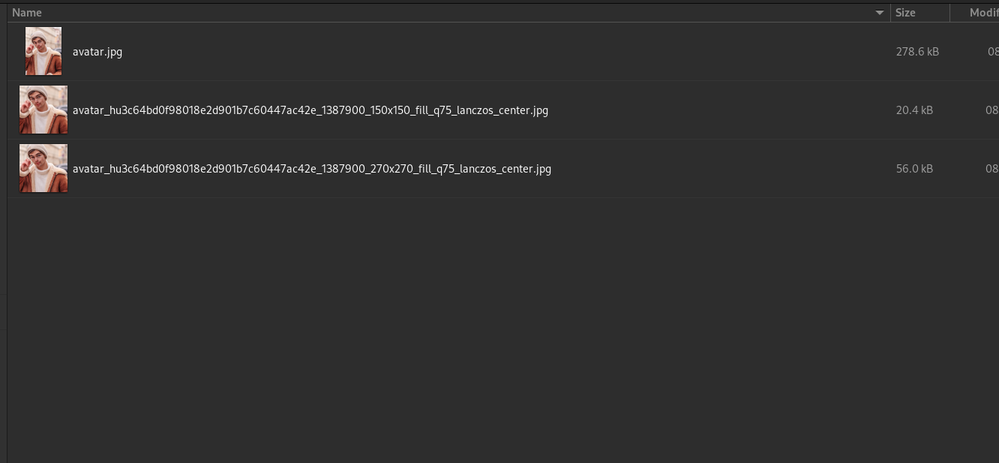
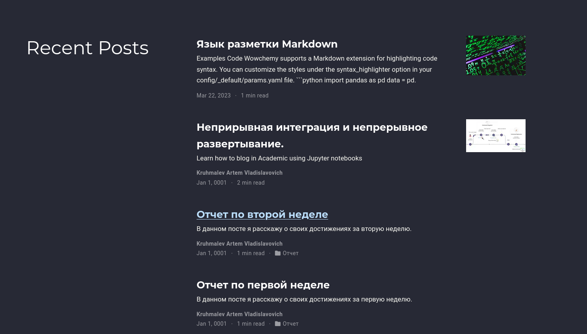
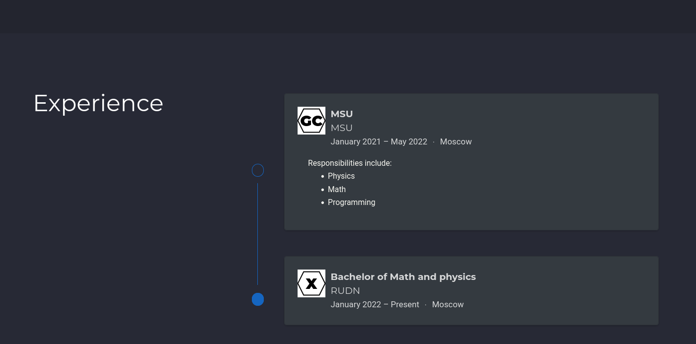
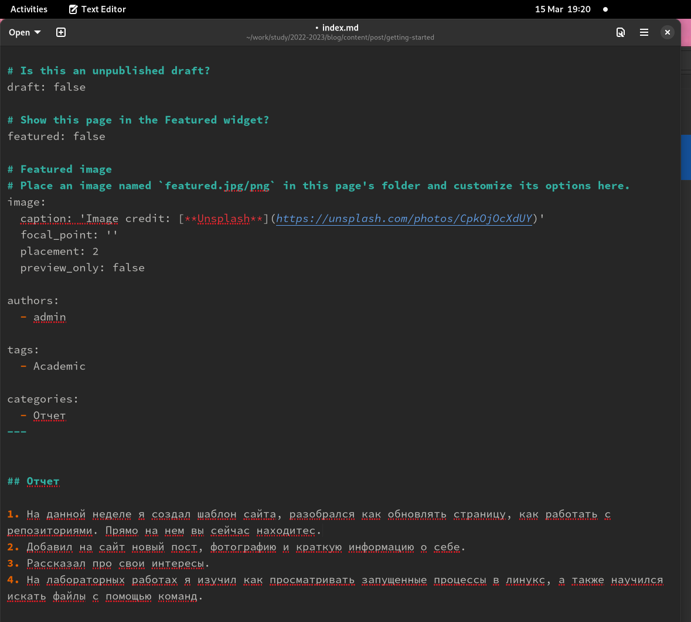
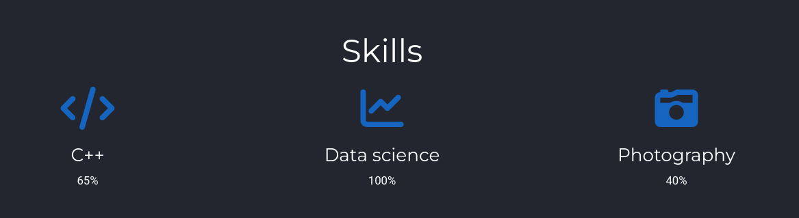
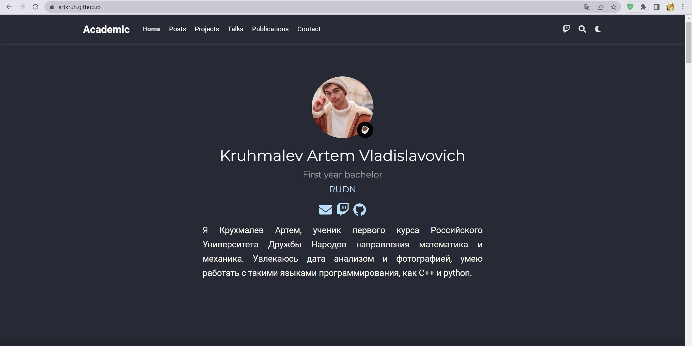

---
## Front matter
lang: ru-RU
title: Проект этап 2
author:
  - Крухмалев А.В.
institute:
  - Российский университет дружбы народов, Москва, Россия
date: 15 марта

## i18n babel
babel-lang: russian
babel-otherlangs: english

## Formatting pdf
toc: false
toc-title: Содержание
slide_level: 2
aspectratio: 169
section-titles: true
theme: metropolis
header-includes:
 - \metroset{progressbar=frametitle,sectionpage=progressbar,numbering=fraction}
 - '\makeatletter'
 - '\beamer@ignorenonframefalse'
 - '\makeatother'
---

## Цель работы

Научиться работать с сайтом

## Задание

Добавить фотографию, краткую информацию о себе.

# Выполнение проекта

## Добавим свои фотографии на начальную страницу

{ #fig:001 width=70% }

## Заполним папку админ личной информацией 

{ #fig:002 width=70% }

{ #fig:007 width=70% }

## Перейдем в папку для написания постов и напишем короткий пост о результатх прошедшей недели

{ #fig:003 width=70% }

{ #fig:008 width=70% }

## Теперем напишем небольшой пост о непрерывной интеграции и непрерывном развертывание

{ #fig:004 width=70% }

## Зальем все на гитхаб и проверим что все отобразилось исправно.

{ #fig:006 width=70% }
## Выводы

Второй этап проекта завершен, шинформация добавлена.
