---
## Front matter
lang: ru-RU
title: Проект этап 1
author:
  - Крухмалев А.В.
institute:
  - Российский университет дружбы народов, Москва, Россия
date: 23 февраля 2023

## i18n babel
babel-lang: russian
babel-otherlangs: english

## Formatting pdf
toc: false
toc-title: Содержание
slide_level: 2
aspectratio: 169
section-titles: true
theme: metropolis
header-includes:
 - \metroset{progressbar=frametitle,sectionpage=progressbar,numbering=fraction}
 - '\makeatletter'
 - '\beamer@ignorenonframefalse'
 - '\makeatother'
---

## Цель работы

Создать шаблон сайта 

## Задание

Сделать необходимые репозитории 

# Выполнение работы работы

## Скачаем необходимый файл hugo

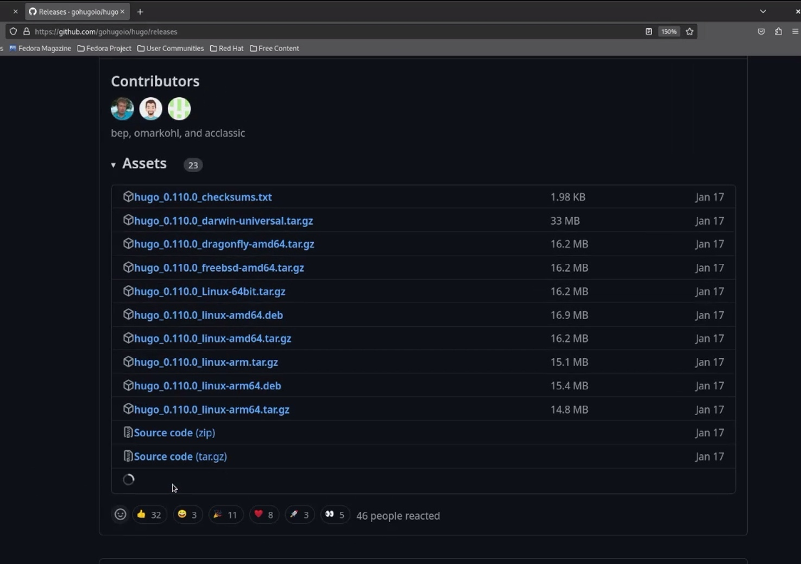{ #fig:001 width=40% }

## Добавим новый репозиторий blog.

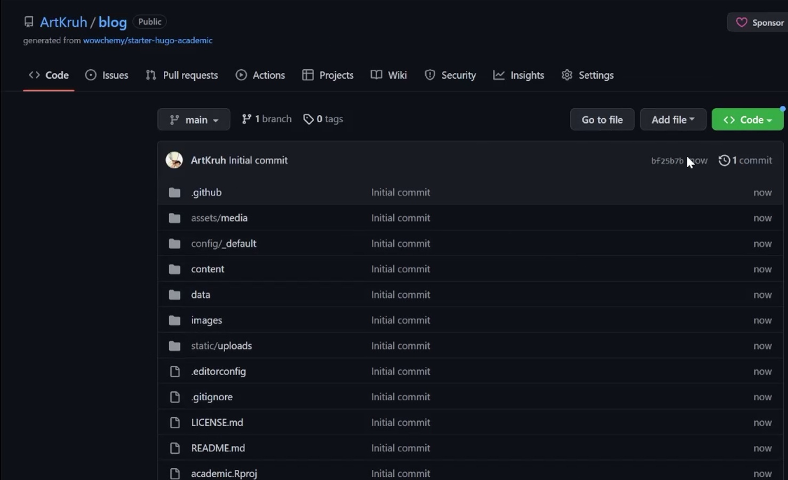{ #fig:002 width=40% }

## Скачаем репозиторий и выполним команду hugo server

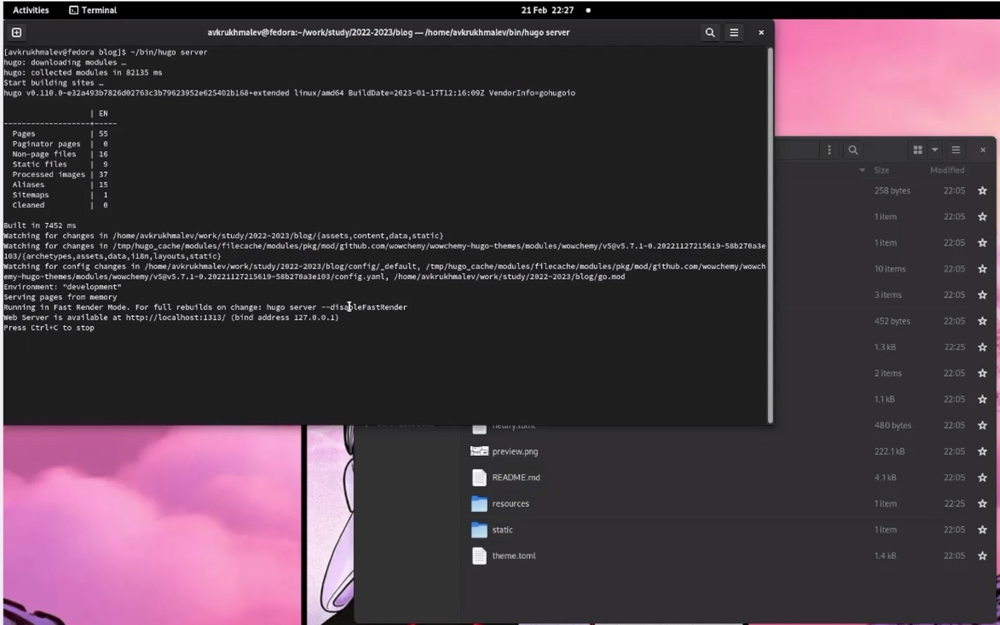{ #fig:003 width=40% }

## Полученную ссылку открываем в браузере и видим шаблон

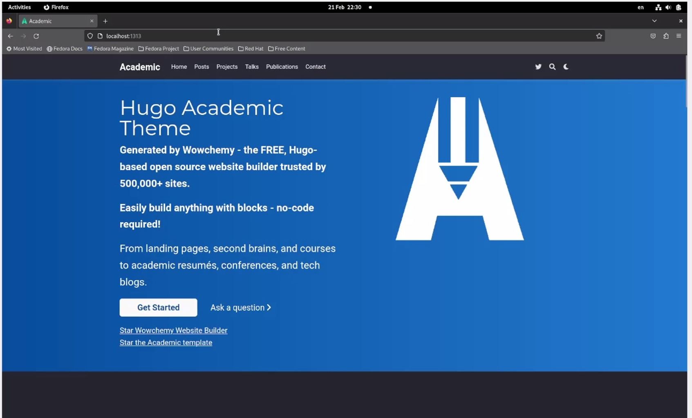{ #fig:004 width=40% }

## Создадим новый репозиторий ArtKruh.github.io

![ArtKruh.github.io] (image/5.jpg){ #fig:014 width=40% }

## Скачаем пустой репозиторий себе в систему.

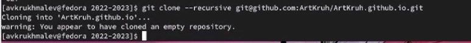{ #fig:006 width=70% }

## Создадим ветку мейн и сощдадим файл README.md, добавим на гитхаб.

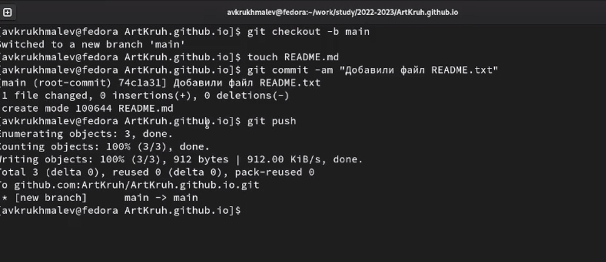{ #fig:007 width=70% }

## Новый репозиторий в гите.

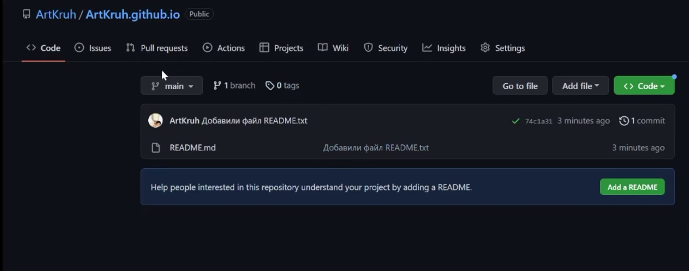{ #fig:009 width=40% }

## Создадим папку паблик, заметим, что вывело ошибку.

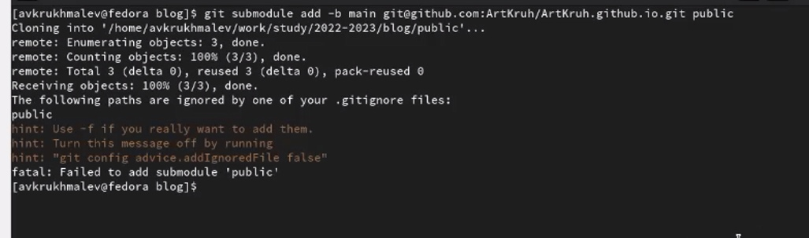{ #fig:011 width=70% }

## Уберем комментирование в gitignore.

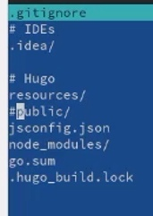{ #fig:012 width=40% }

## Повторим длинную команду и создадим папку public.

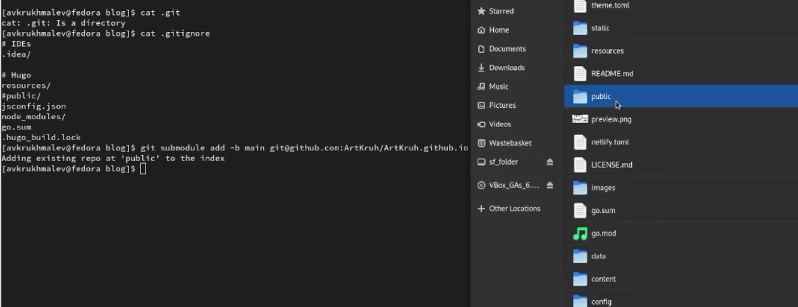{ #fig:013 width=70% }

## Напишем команду hugo, заметим, что у нас создались новые файлы.

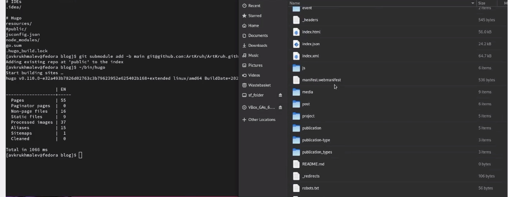{ #fig:014 width=70% }

## По ссылке зайдем на наш сайт, заметим что он совпадает с хостом, что и нужно было получить.

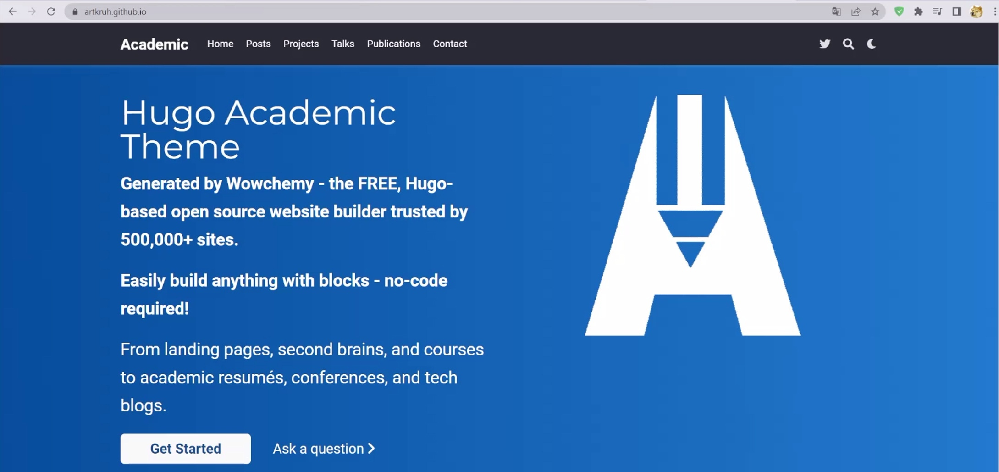{ #fig:015 width=70% }

## Выводы

Первый этап проекта завершен, шаблон файла создан.

