---
## Front matter
title: "Проект 1 этап"
subtitle: "НММ-бд-02-22"
author: "Крухмалев Артём Владиславович"

## Generic otions
lang: ru-RU
toc-title: "Содержание"

## Bibliography
bibliography: bib/cite.bib
csl: pandoc/csl/gost-r-7-0-5-2008-numeric.csl

## Pdf output format
toc: true # Table of contents
toc-depth: 2
fontsize: 12pt
linestretch: 1.5
papersize: a4
documentclass: scrreprt
## I18n polyglossia
polyglossia-lang:
  name: russian
  options:
	- spelling=modern
	- babelshorthands=true
polyglossia-otherlangs:
  name: english
## I18n babel
babel-lang: russian
babel-otherlangs: english
## Fonts
mainfont: PT Serif
romanfont: PT Serif
sansfont: PT Sans
monofont: PT Mono
mainfontoptions: Ligatures=TeX
romanfontoptions: Ligatures=TeX
sansfontoptions: Ligatures=TeX,Scale=MatchLowercase
monofontoptions: Scale=MatchLowercase,Scale=0.9
## Biblatex
biblatex: false
biblio-style: "gost-numeric"
biblatexoptions:
  - parentracker=true
  - backend=biber
  - hyperref=auto
  - language=auto
  - autolang=other*
  - citestyle=gost-numeric
## Pandoc-crossref LaTeX customization
figureTitle: "Рис."
tableTitle: "Таблица"
listingTitle: "Листинг"
lofTitle: "Список иллюстраций"
lotTitle: "Список таблиц"
lolTitle: "Листинги"
## Misc options
indent: true
header-includes:
  - \usepackage{indentfirst}
  - \usepackage{float} # keep figures where there are in the text
  - \floatplacement{figure}{H} # keep figures where there are in the text
---

# Цель работы

Создать шаблон сайта 

# Задание

Сделать необходимые репозитории 

# Выполнение проекта

1. Скачаем необходимый файл hugo

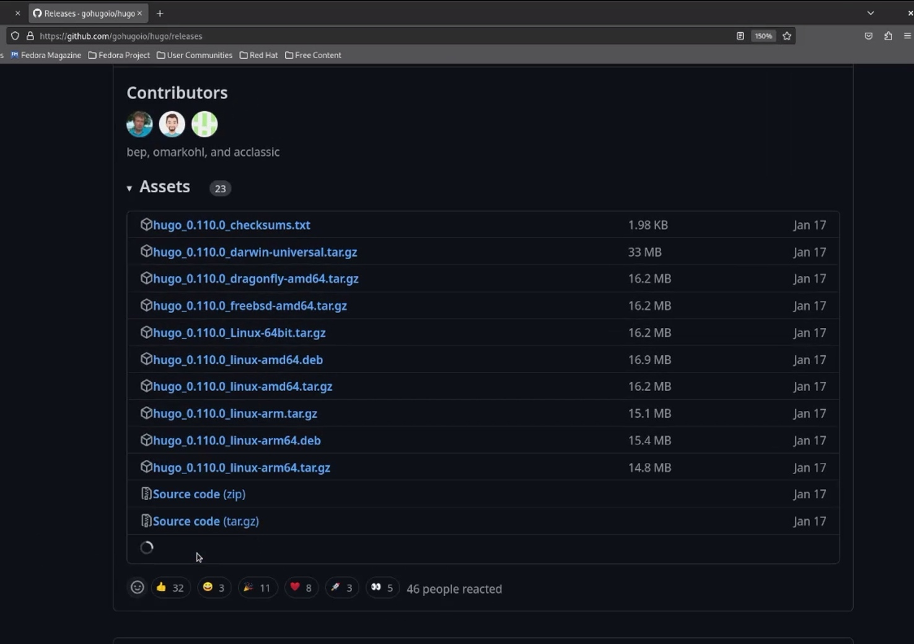{ #fig:001 width=70% }

2. Добавим новый репозиторий blog.

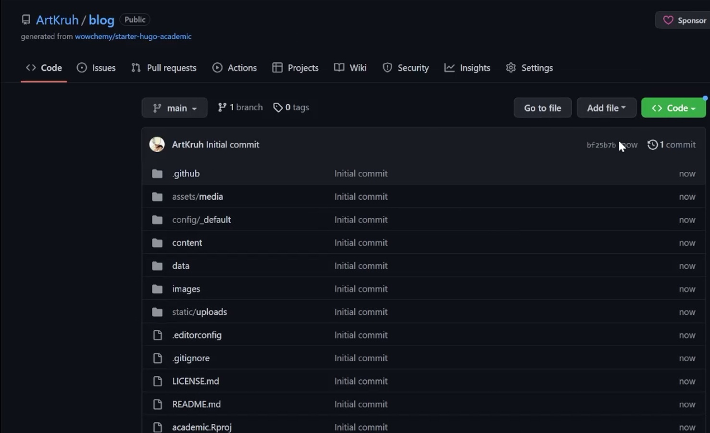{ #fig:002 width=70% }

3. Скачаем репозиторий себе на компьютер и выполним команду hugo server.

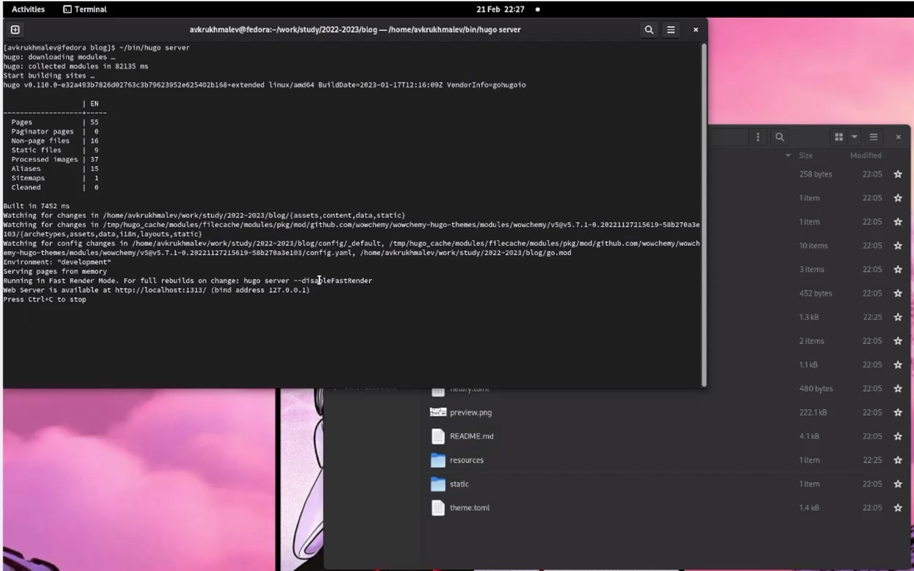{ #fig:003 width=70% }

4. Полученную ссылку открываем в браузере и видим шаблон.

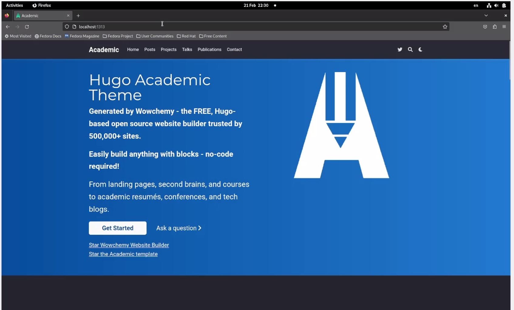{ #fig:004 width=70% }

5. Создадим новый репозиторий ArtKruh.github.io

![ArtKruh.github.io] (image/5.jpg){ #fig:005 width=70% }

6. Скачаем пустой репозиторий себе в систему.

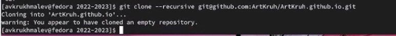{ #fig:006 width=70% }

7. Создадим ветку мейн и сощдадим файл README.md, добавим на гитхаб.

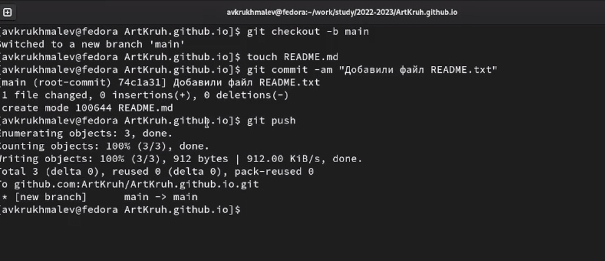{ #fig:007 width=70% }

8. Новый репозиторий в гите.

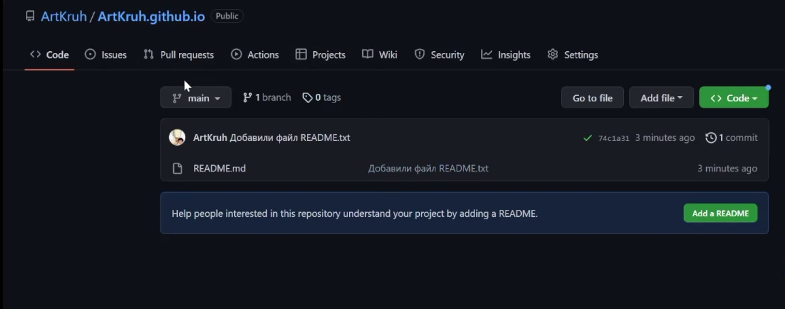{ #fig:009 width=70% }

9. Создадим папку паблик, заметим, что вывело ошибку.

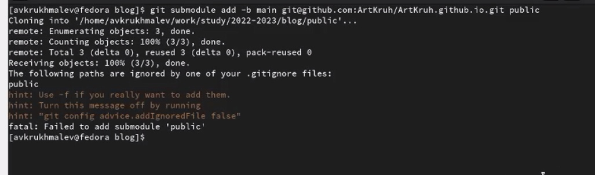{ #fig:011 width=70% }

10. Уберем комментирование в gitignore.

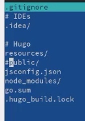{ #fig:012 width=70% }

11. Повторим длинную команду и создадим папку public.

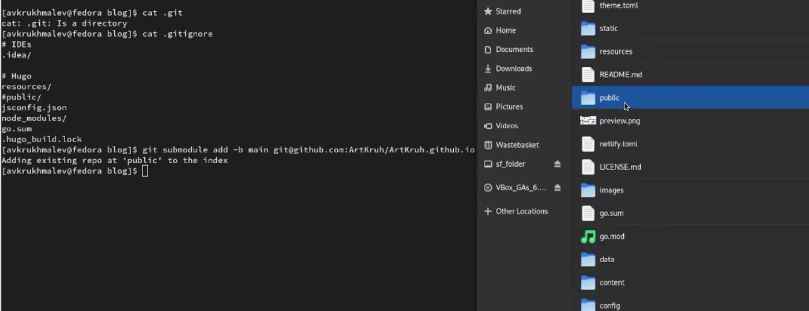{ #fig:013 width=70% }

12. Напишем команду hugo, заметим, что у нас создались новые файлы.

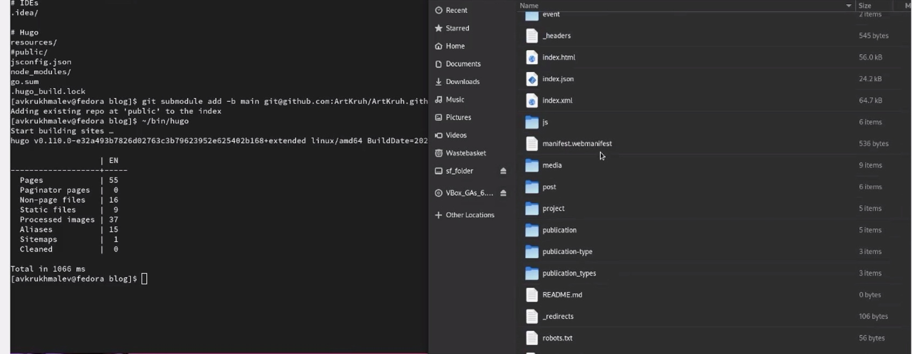{ #fig:014 width=70% }

13. По ссылке зайдем на наш сайт, заметим что он совпадает с хостом, что и нужно было получить.

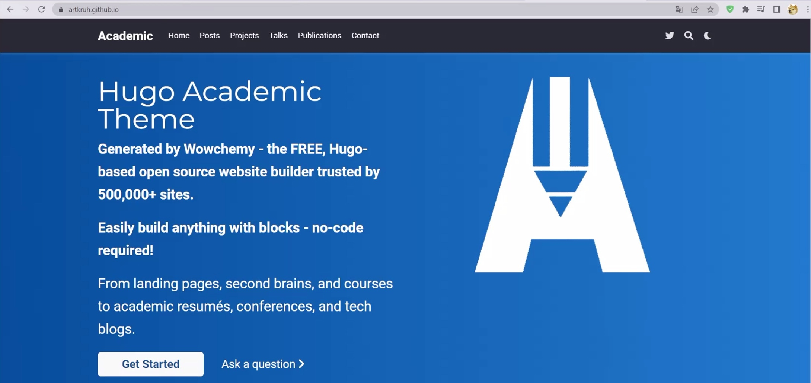{ #fig:015 width=70% }

# Выводы

Первый этап проекта завершен, шаблон файла создан.

:::
